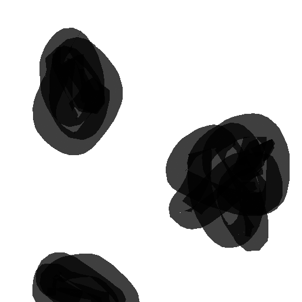

## Jan 2026

This is a markdown document made in RStudio. It's a great way for me to share code and figures by directly accessing them in my code rather than copy-pasting images.

Currently my code is structured such that I have a script for functions related to modelling and a script for functions related to plotting/mapping. To run simulations I source both of those scripts:

```{r sourcing}
source("code/mapping.R")
source("code/model.R")
```

then call whatever functions as I need them. I ran into many problems getting it to this state of functionality. I'll spare you the details, but it's exciting to be at this point, to look at my assumptions with greater detail, and incorporate more nuance and complexity.

These first functions import an image of a "landscape", break it into a hex grid, and assign a simple "high" or "low" habitat quality to each hex based on the colour/lightness of the contributing pixels.

```{r load blob landscape}

blob_landscape <- load_landscape(
  "images/blobs.png", 
  scale = 0.5, # Shrink or grow image
  cellsize = 10) # Lower gives finer detail
blob_landscape <- basic_habitat_quality(blob_landscape, threshold = 0.5)
blob_landscape$Q <- ifelse(blob_landscape$type == "high", 1, 0)
```

Here's what this landscape looks like:

{width="300"}

Here it is as hexes:

```{r blob hexes}
visualise_landscape(blob_landscape)
```

And, for fun, here is the rough shape of our field site at Andy's clear cut, hexified:

```{r load clearcut, echo=FALSE}
nb_landscape <- load_landscape(
  "images/nb-scape-bw-thick.png", 
  scale = 0.5, # Shrink or grow image
  cellsize = 10) # Lower gives finer detail
nb_landscape <- basic_habitat_quality(nb_landscape, threshold = 0.5)
nb_landscape$Q <- ifelse(nb_landscape$type == "high", 1, 0)
visualise_landscape(nb_landscape)
```

The general idea is to populate the landscape with FTC by specifying the relative density per hex. Total density for the image sums to 1, so if a particular hex had 0.05 density you would interpret it as "of all the FTC in this area, 5% of them are in this hex". Because we have been looking at FTC dispersing out of suitable habitat, let's initialize the landscape with no FTC in the low quality areas (grey) and an even distribution of FTC in the high quality areas (green).

```{r init density}
timesteps <- 4
H <- matrix(0, nrow = nrow(nb_landscape), ncol = timesteps)
H[nb_landscape$type == "high",1] = 1
H[,1] <- H[,1] / sum(H[,1])
```

Here's a visualisation of this initial density.

```{r clearcut init density viz}
dots <- dot_density_points(nb_landscape, density = H[,1], dot_clutter = 5)
visualise_landscape(nb_landscape, dots = dots, dotsize = 1, show_legend = FALSE)
```

Now we want to disperse these FTC across the landscape according to a dispersal kernel at regular time steps. First, compute possible "destination" hexes for each "origin" hex, and the associated distances:

```{r cleracut neighbors and distances}
max_host_dispersal <- 12
neighbs <- compute_neighbors(nb_landscape, max_host_dispersal)
dists <- compute_sparse_distance(nb_landscape, neighbs, max_host_dispersal)
```

`max_host_dispersal` is the maximum number of hexes an FTC will disperse. We know that some FTC fly very far, but for practical reasons we will set this to capture *most* of the dispersers. We can potentially incorporate long distance dispersers later. For now, we consider short-range dispersal and set a max range of 12 hexes (\~300m at this hex size) and move on to set up the dispersal kernel:

```{r clearcut dispersal}
scale <- 2
stay_prob <- 0.5
beta <- 1
K <- initialize_dispersal(
  dists, # sparse distance matrix
  scale, # drop-off scale
  stay_prob, # probability of staying in cell
  kernel_function = "negative_exp",
  beta, # habitat preference strength
  Q = nb_landscape$Q # habitat quality vector
)
```

To initialize dispersal we take a few inputs: A `kernel_function,` which is the distribution FTC will draw from to disperse - in this case I'm using a very simple negative exponential function: $e^{(-\frac{dists}{scale})}$ - where `dists` is the distance matrix calculated a moment ago and `scale` is a parameter that sets how "slow" movement distance drops off (higher number mean more FTC disperse further). `stay_prob` is the probability of an FTC just staying put and not dispersing (0.5 for now) and `beta` is a parameter that controls how much an FTC prefers moving towards high quality habitat.

Now a `for` loop to simulate multiple instances of dispersal.

```{r clearcut disperse}
for (i in 2:timesteps) {
  H[,i] <- disperse(
    kernel = K,
    density = H[,i-1],
    survival = 1
  )
}
```

After one round of dispersal:

```{r, echo=FALSE}
dots <- dot_density_points(nb_landscape, density = H[,2], dot_clutter = 5)
visualise_landscape(nb_landscape, dots = dots, dotsize = 1, show_legend = FALSE)
```

After two rounds:

```{r, echo=FALSE}
dots <- dot_density_points(nb_landscape, density = H[,3], dot_clutter = 5)
visualise_landscape(nb_landscape, dots = dots, dotsize = 1, show_legend = FALSE)
```

After three rounds:

```{r, echo=FALSE}
dots <- dot_density_points(nb_landscape, density = H[,4], dot_clutter = 5)
visualise_landscape(nb_landscape, dots = dots, dotsize = 1, show_legend = FALSE)
```

---

This is just a demo set of movement parameters. The most important factor to what you're seeing is the `scale` parameter, which I set to 2 as a proof of concept. Next step is to parameterize my function according to how others have done it in the past for FTC (e.g., Hughes, Roland, Cobbold).

An interesting thing to note is that this landscape is a cylinder. When FTC encounter the sides they wrap around to the other side and when they encounter the top, they fall off[^1].

[^1]:  For awhile I was working with absorbing boundaries everywhere and incorporated horizontal wrapping more recently, I just realized I might not have correctly re-applied absorbing conditions on the top and bottom so I'll have to check that.

Briefly, some ideas for what to do next:

-   Check more "FTC-appropriate" dispersal parameters

-   Check boundary conditions

-   Explore the current "parameter space" by changing survival, "staying-in-place" prob, and habitat preference parameters along with the change in dispersal.

-   Incorporate parasitoids

-   Incorporate density dependent movement. Organisms should prioritize better habitat, but they should also avoid overcrowding.

-   Incorporate more complex resources. E.g., more categories than just "high" and "low" and give habitats the ability to change quality (be depleted)

-   Incorporate edge effects. Something like, use a different movement kernel when moving between hexes of different quality

-   Track growth and death on the landscape

Would you like to see anything done with what I have right here? I can try different landscapes and parameters.
